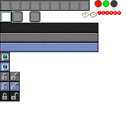

# PythonCraft

Python ve Pyglet kullanılarak geliştirilmiş, OpenGL tabanlı bir Minecraft klonudur. Bu proje, voxel tabanlı bir dünyanın nasıl oluşturulacağını, render edileceğini ve temel oyun mekaniklerinin nasıl işleneceğini göstermektedir.

 *(Görseli kendi ekran görüntünüzle değiştirebilirsiniz)*

## 🚀 Özellikler

- **Chunk Sistemi:** Verimli bir dünya yönetimi için chunk tabanlı yükleme/boşaltma sistemi.
- **Envanter ve Crafting:** Tam fonksiyonel envanter sistemi ve eşya üretme mekanikleri.
- **Mob Sistemi:** Yapay zekaya sahip canlılar (Domuzlar vb.).
- **Gelişmiş Aydınlatma:** Gerçek zamanlı güneş ışığı ve blok ışığı hesaplamaları.
- **GPU Su Simülasyonu:** OpenGL compute shaderları veya gelişmiş tekniklerle su akış simülasyonu.
- **Parçacık Sistemi:** Blok kırma ve patlama efektleri için parçacık motoru.
- **Ses Sistemi:** Konumsal (3D) ses desteği.
- **Kaydetme Sistemi:** Dünyayı ve oyuncu ilerlemesini otomatik kaydetme.

## 🛠️ Kurulum

Projeyi çalıştırmak için bilgisayarınızda Python yüklü olmalıdır.

1. **Depoyu klonlayın:**
   ```bash
   git clone <repo-url>
   cd python-minecraft-clone
   ```

2. **Gerekli kütüphaneleri yükleyin:**
   ```bash
   pip install -r requirements.txt
   ```

3. **Oyunu başlatın:**
   ```bash
   python main.py
   ```

## 🎮 Kontroller

- **W, A, S, D:** Hareket
- **Fare:** Bakış yönü
- **Sol Tık:** Blok Kırma
- **Sağ Tık:** Blok Koyma (Veya eşya kullanma)
- **E:** Envanter / Crafting Menüsü
- **1-9:** Hızlı erişim çubuğu seçimi
- **Sol Shift:** Çömelme
- **Boşluk (Space):** Zıplama / Uçarken yukarı çıkış
- **ESC:** Fareyi serbest bırakma ve Menü

## 📦 Gereksinimler

- Python 3.x
- Pyglet (Modern OpenGL destekli sürüm)
- Grafik kartınızın OpenGL 3.3+ desteklemesi önerilir.

## 🤝 Katkıda Bulunma

1. Bu depoyu fork edin.
2. Yeni bir özellik dalı (branch) oluşturun (`git checkout -b ozellik/yeniOzellik`).
3. Değişikliklerinizi commit edin (`git commit -m 'Yeni özellik eklendi'`).
4. Dalınıza push yapın (`git push origin ozellik/yeniOzellik`).
5. Bir Pull Request oluşturun.

## 📄 Lisans

Bu proje MIT lisansı ile lisanslanmıştır. Daha fazla bilgi için `LICENSE` dosyasına bakabilirsiniz.
